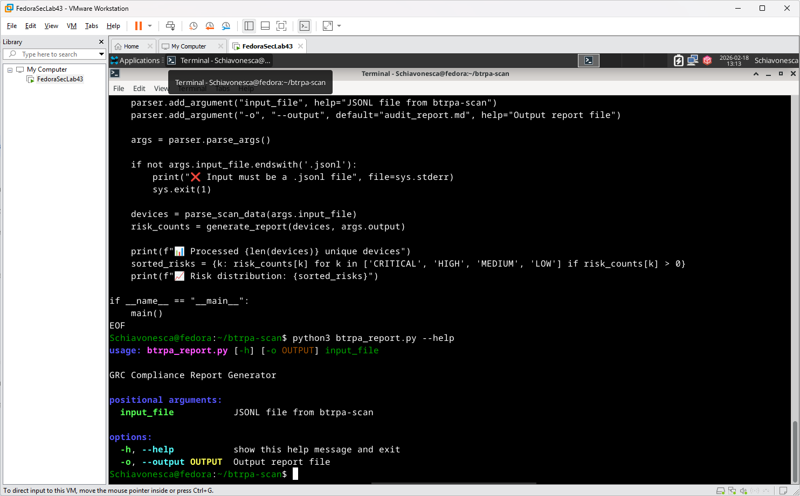
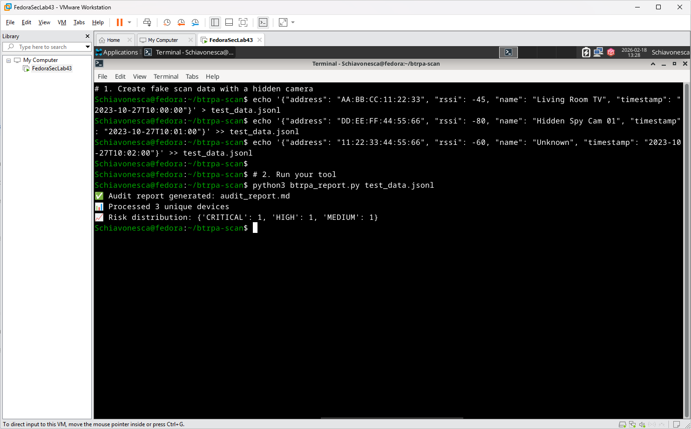

# btrpa-scan (GRC Enhancement)

**Developed by: Nenad Uzelac**

This repository is a GRC-focused fork of the original `btrpa-scan` utility. I have implemented a custom **Risk Scoring Engine** to automate the analysis of Bluetooth environments, specifically aligning technical telemetry with **NIST SP 800-121 Rev 2** compliance standards.

## 📊 Project Features
* **Automated Risk Triage:** Instantly flags "Critical" threats (e.g., unauthorized surveillance devices) using keyword-based risk signatures.
* **Proximity Analysis:** Dynamically calculates risk levels based on Signal Strength (RSSI) to identify physical security boundaries.
* **Compliance Reporting:** Generates structured Markdown reports designed for internal audit documentation and executive review.

## 📸 Technical Demo

### 1. Command Line Interface (CLI)
A professional CLI implementation allowing auditors to ingest JSONL scan data and define output parameters for GRC reporting.

### 2. Live Risk Assessment
A demonstration of the engine identifying a "Hidden Spy Cam" and assigning a **CRITICAL** risk score based on pre-defined security controls.

## ⚖️ Credits & Attribution
* **Original Author:** [Dave Kennedy (HackingDave)](https://github.com/hackingdave) / [TrustedSec](https://github.com/trustedsec).
* **Original Project:** [btrpa-scan](https://github.com/hackingdave/btrpa-scan) — A tool for scanning and identifying Bluetooth devices.
* **GRC Enhancements:** Logic for NIST-aligned risk scoring, automated reporting, and audit-trail generation developed by **Nenad Uzelac**.

---
*Note: This project was developed as part of my learning path in GRC, Cybersecurity, and IT Audit within regulated environments.*
